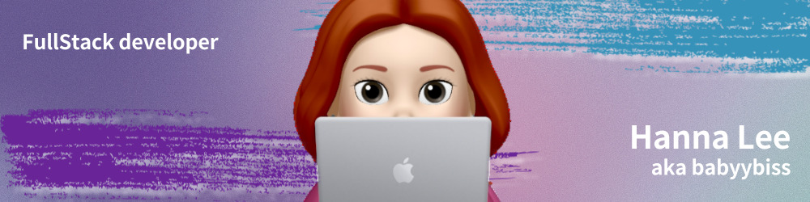

<h1 align="center">Hello I'm Hanna Lee</h1>

 🇰🇷 한글 버전 : https://github.com/babyybiss/babyybiss/blob/main/README(KOR).md 
 

## 👨🏻‍💻 About Me:

- 🖐Hi there!, I'm Hanna Lee.

- 🙋‍♂️ I'm a passionate developer from Korea!

- 📖 I enrolled in HiMedia bootcamp.

- 👨‍💻 I’m currently a `Fullstack software engineer`.

- 💻 Creating dynamic, interactive websites for everyone.

- 🚀 Exploring foundational and advanced concepts, applying practical skills to real-world projects.

- ⚡ Fun fact: I'm a tech enthusiast always on the strive to learn!

- 👨‍💻 Life Hack: Action is the foundational key to all success. Stop thinking, start doing, and pave your own path :tada:

## 🛠️ Technologies and Tools I use:

&emsp;
&emsp;

 

<h2>GitHub Stats:</h2>

            

  

<h2>📫 How to reach me:</h2>

<h3 align="left">Connect with me:</h3>

<!--
**babyybiss/babyybiss** is a ✨ _special_ ✨ repository because its `README.md` (this file) appears on your GitHub profile.

Here are some ideas to get you started:

- 🔭 I’m currently working on ...
- 🌱 I’m currently learning ...
- 👯 I’m looking to collaborate on ...
- 🤔 I’m looking for help with ...
- 💬 Ask me about ...
- 📫 How to reach me: ...
- 😄 Pronouns: ...
- ⚡ Fun fact: ...
-->
