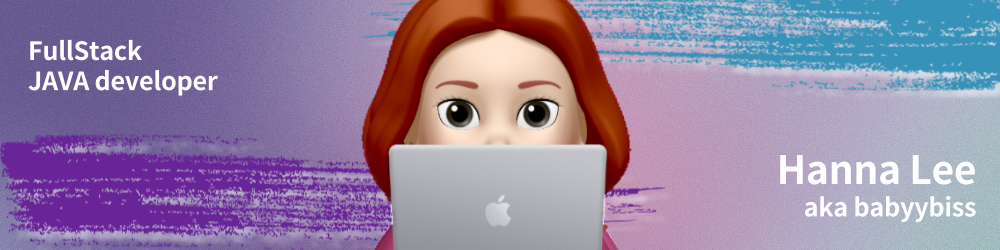

 

<h2>Hey! 👋</h2>

I'm a passionate developer from Korea!

- Currently: MSA cloud based JAVA Full Stack developement student at HiMedia Edu.
- Previously: Front End dev

<h2>💻I'm Currently working on</h2>

- Data Base manipulation

- Software Engineering

<h2>👀 Stats</h2>

<h2>📫 How to reach me:</h2>

<h3 align="left">Connect with me:</h3>

<!--
**babyybiss/babyybiss** is a ✨ _special_ ✨ repository because its `README.md` (this file) appears on your GitHub profile.

Here are some ideas to get you started:

- 🔭 I’m currently working on ...
- 🌱 I’m currently learning ...
- 👯 I’m looking to collaborate on ...
- 🤔 I’m looking for help with ...
- 💬 Ask me about ...
- 📫 How to reach me: ...
- 😄 Pronouns: ...
- ⚡ Fun fact: ...
-->
